# 手牌容器

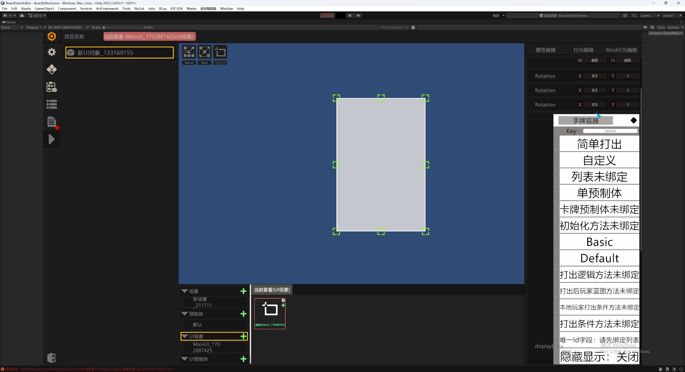

手牌容器用于制作玩家的手牌，包含多种参数设置

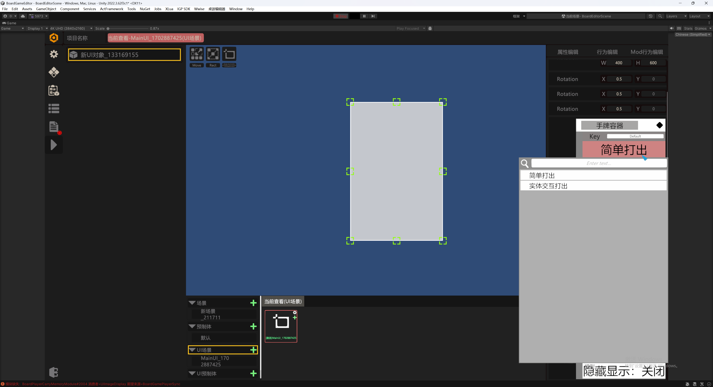

打出方式：

简单打出只需玩家点击并拖动卡牌即可打出。

实体交互打出需要玩家拖动卡牌到场景内的某个物体上，判断是否打出成功。

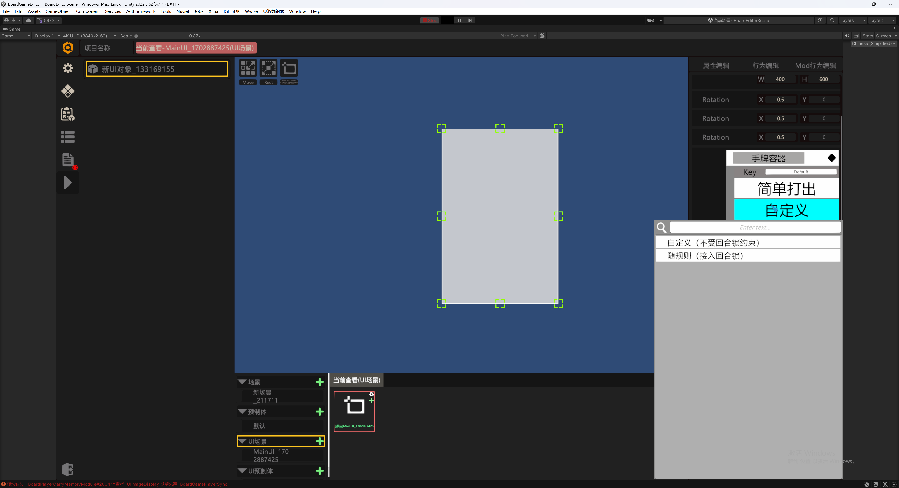

规则锁：

当设置规则锁时，只有当前回合制行动的玩家可以进行出牌操作。

未设置规则锁时，每位玩家都可以进行出牌操作，具体是否能成功出牌需要桌游创作者自行设置逻辑限制。

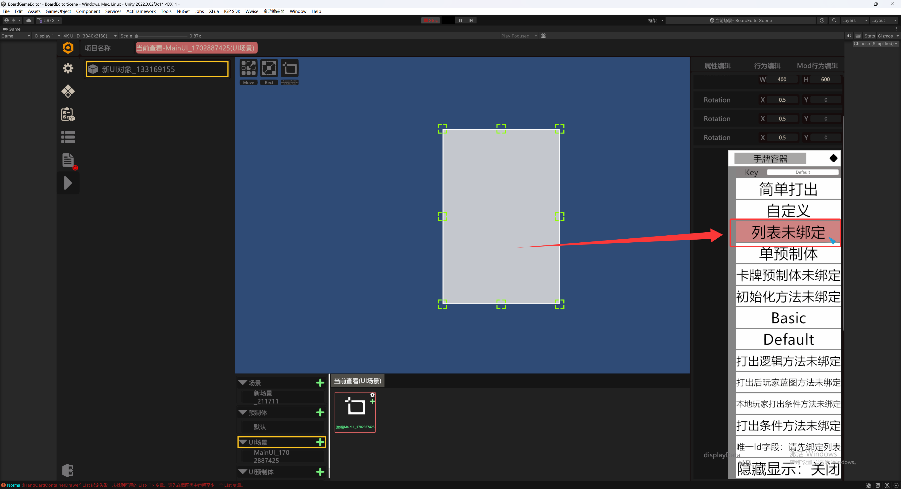

数据绑定列表：

手牌容器需要绑定玩家蓝图内的List<卡牌结构体>属性才能在运行时正确生成卡牌预制体，为此需要在玩家蓝图里创建一个List<卡牌结构体>变量，并绑定到手牌容器上。

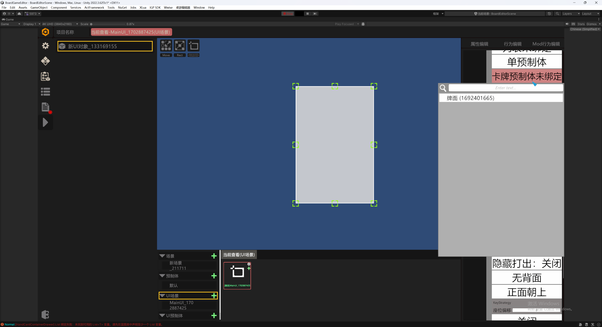

卡牌预制体绑定：

手牌容器需要绑定卡牌预制体，创作者应该事先创建好卡牌预制体后在此处绑定。

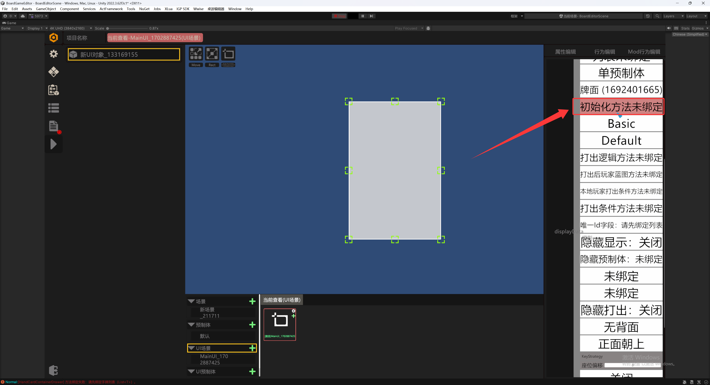

卡牌初始化方法绑定：

在卡牌蓝图中需要创建卡牌初始化方法，以此将玩家手牌List中的卡牌数据赋给手牌容器中对应的每一张卡牌预制体上，在此处绑定。

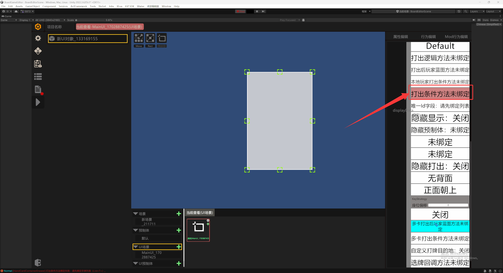

可否打出卡牌逻辑判断方法：

当玩家进行出牌操作时，需要对打出的卡牌是否能成功打出进行判断，为此需要在卡牌蓝图中新建一个函数，传入参数为卡牌的结构体，输出参数为bool，将该函数绑定到此处。

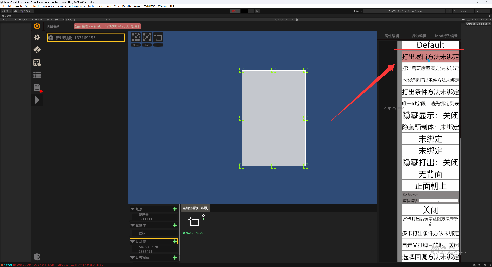

打出卡牌后的行为方法绑定：

在玩家成功出牌后，如果卡牌有需要执行的具体卡牌效果，需要创作者自行设置，需要在卡牌蓝图内新建一个函数，传入参数为卡牌的结构体，将该函数绑定到此处。

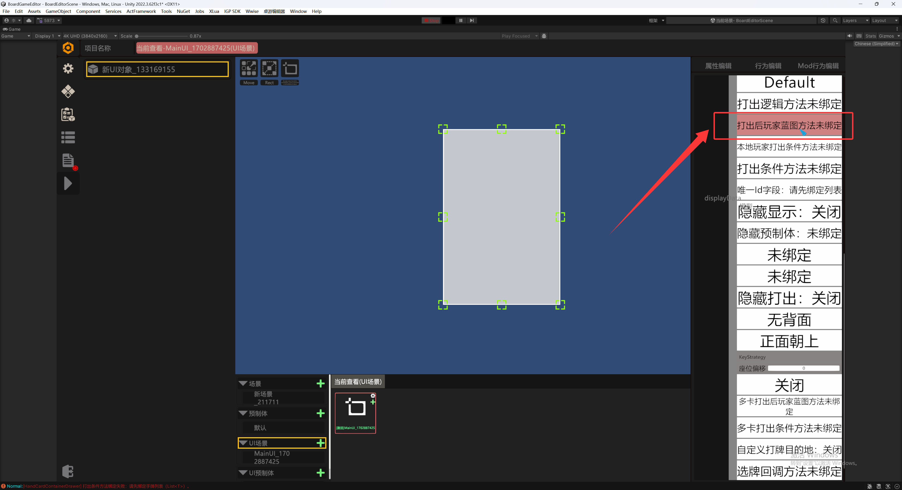

打出卡牌后的玩家行为绑定：

如果玩家出牌后也需要执行一些行为，例如结束回合，则应该在玩家蓝图内新建函数，要求传入参数为卡牌结构体，将该函数绑定到此处。

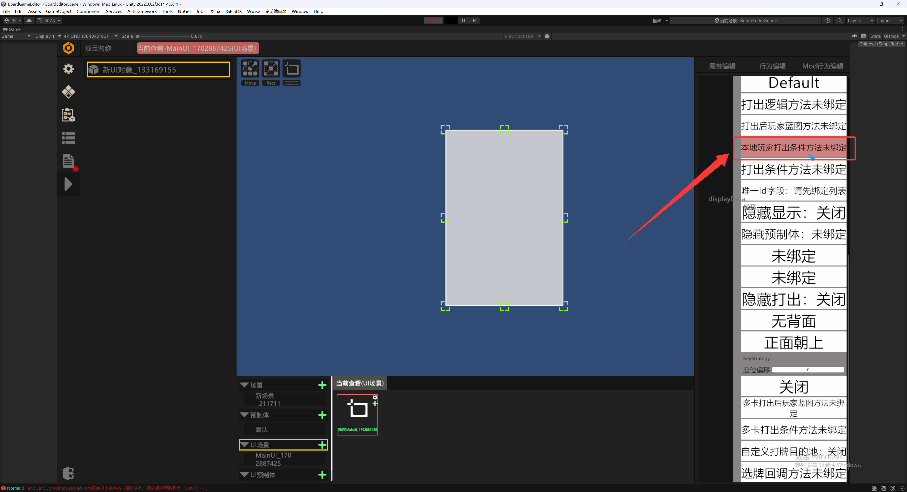

玩家可否打出卡牌逻辑判断：

有时判断卡牌是否能够打出需要结合出牌玩家的一些属性来判断，因此这些函数方法更适合在玩家蓝图内管理（一个简单例子：玩家当前能量是否≥卡牌消耗能量）。这样的函数同样需要传入参数为卡牌的结构体，输出参数为bool，将该函数绑定到此处。

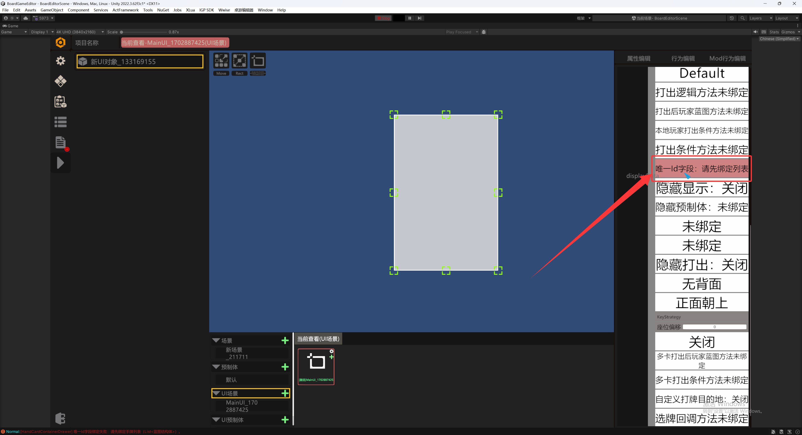

唯一ID字段：

只有绑定ID字段时，卡牌从手牌中打出到牌堆才能播放流畅的过渡动画，为此需要在卡牌预制体中新建一项Int变量作为ID绑定在此处。

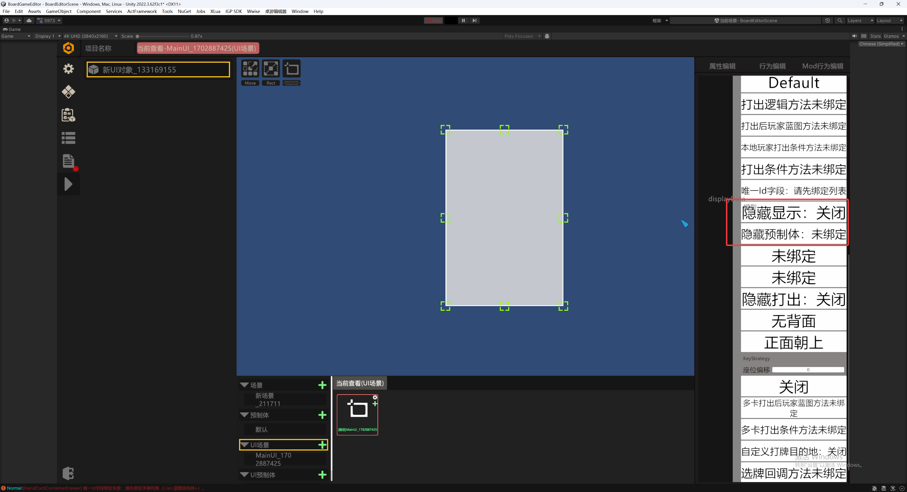

隐藏显示与隐藏预制体：

一般情况下本地玩家视角下看其他玩家的手牌容器时应该只能看到牌背，这时需要设为隐藏显示，并新建一个牌背预制体，然后将牌背预制体绑定到隐藏预制体处。

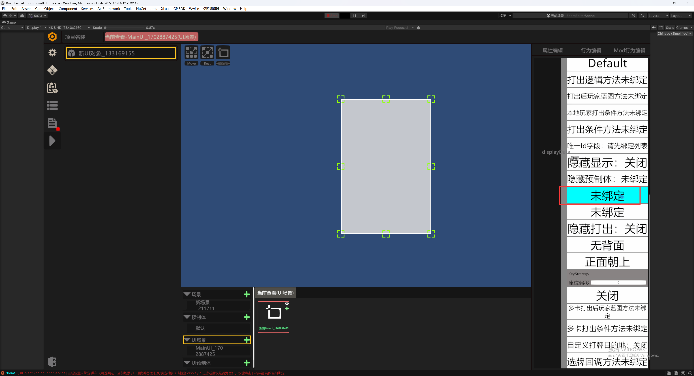

打出后加入的卡堆容器绑定：

当在UI场景内创建一个卡堆容器并在此处绑定后，玩家从手牌中打出的牌将自动加入到卡堆容器里。

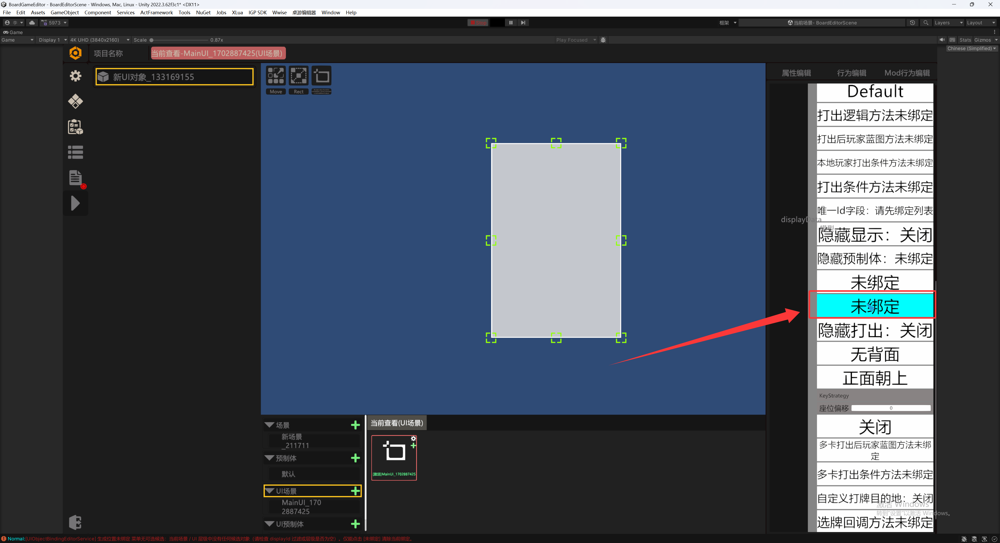

手牌选牌界面生成位置绑定：

当发生手牌选牌事件时，选牌面板将会生成在什么位置，如果未绑定，则默认在手牌容器位置生成。

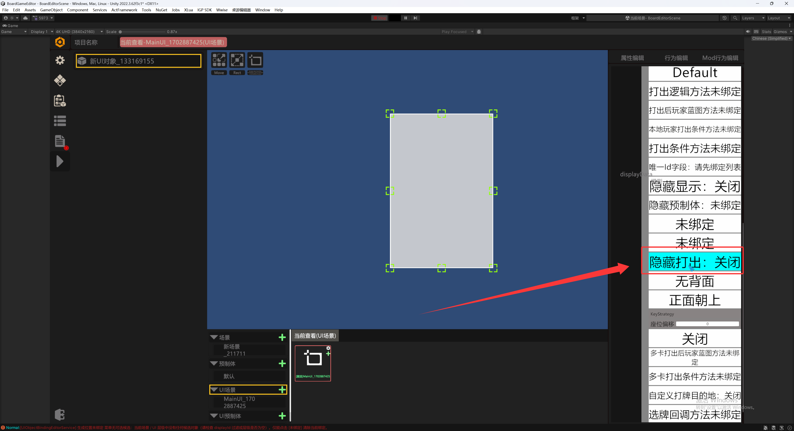

是否隐藏打出：

选择卡牌从手牌打出到卡堆时，是否以隐藏预制体的方式打出。

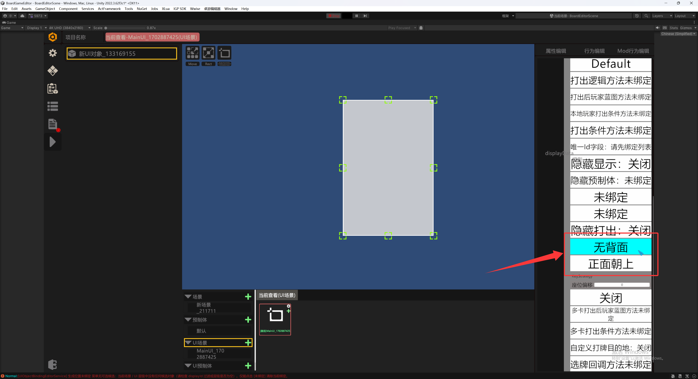

卡牌是否有背面：

通常情况下，本地玩家卡牌全部为正面，其他玩家卡牌全部为背面，但一些游戏内存在翻牌的机制，为此需要给卡牌绑定背面的预制体，用于翻转卡牌。

是否正面朝上是指当玩家第一次初始化卡牌时，卡牌是以正面预制体显示还是背面预制体显示。

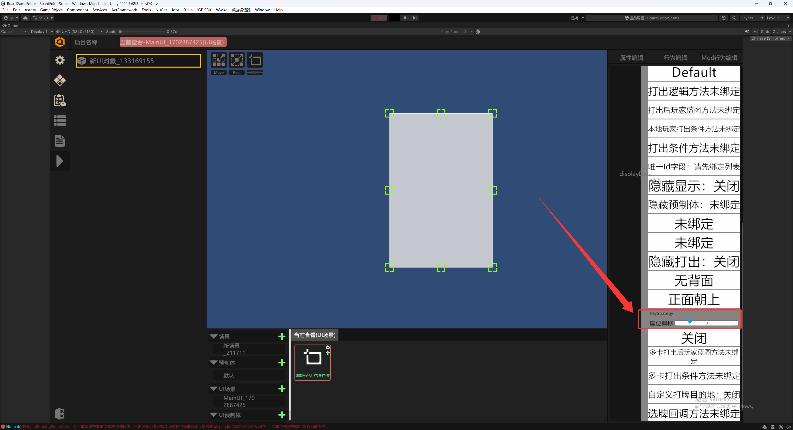

座位偏移：

座位偏移决定了手牌容器显示的是哪位玩家的手牌，值为0时，显示的是本地玩家的手牌，值为1时显示的是下一位玩家的手牌，值为-1时显示的是上一位玩家的手牌。

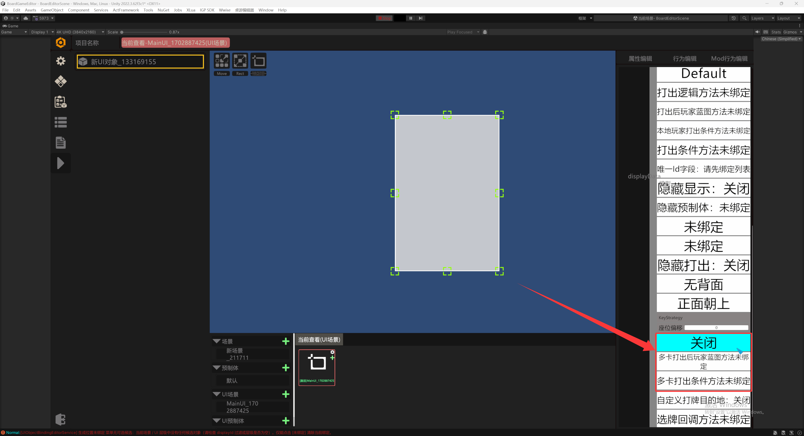

多卡打出：

初始情况默认玩家只能一次打出一张卡牌，如果需要玩家允许一次打出多张卡牌的话需要在此处开启多牌打出模式。

多牌打出模式下，是否允许玩家打出以及打出后的逻辑类似于前文单卡打出的逻辑，只是需要绑定的函数传入参数变为List<卡牌结构体>。

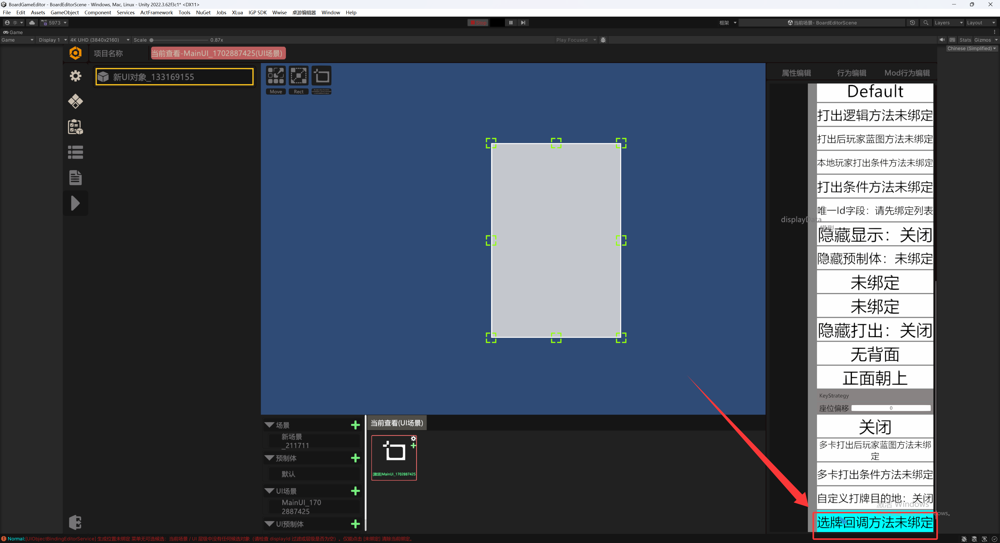

选牌方法回调绑定：

当选牌行为发生后，决定后续执行怎样的逻辑，需要在玩家蓝图内新建一个函数，传入参数为List<卡牌结构体>，绑定在此处。

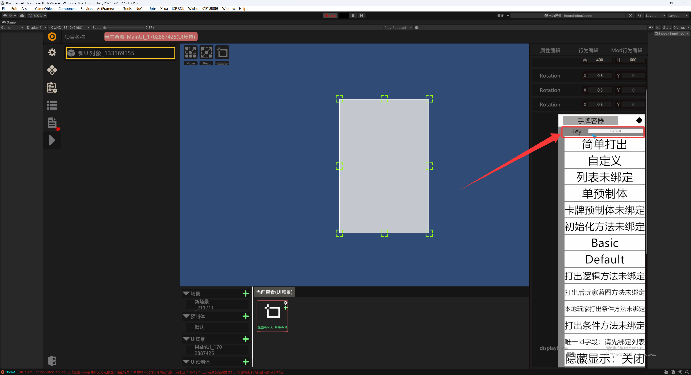

手牌容器Key：

某些桌游规则内可能需要玩家同时管理多套手牌，比如一套资源手牌，一套战斗手牌，为此需要区分同一个玩家当前拥有的不同手牌容器，需要在此处给手牌容器设置不同的key。
